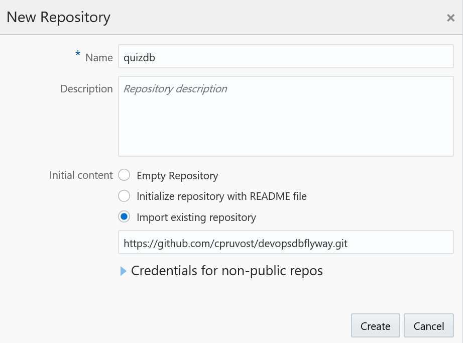
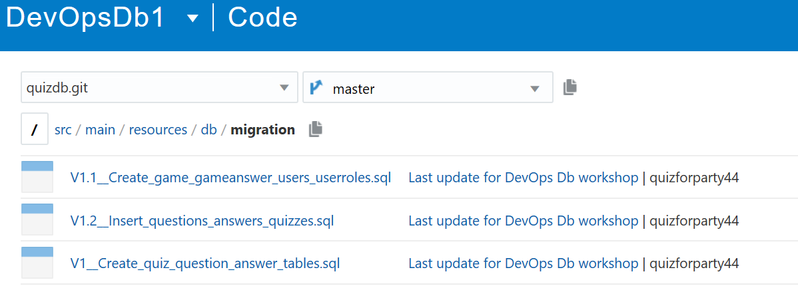
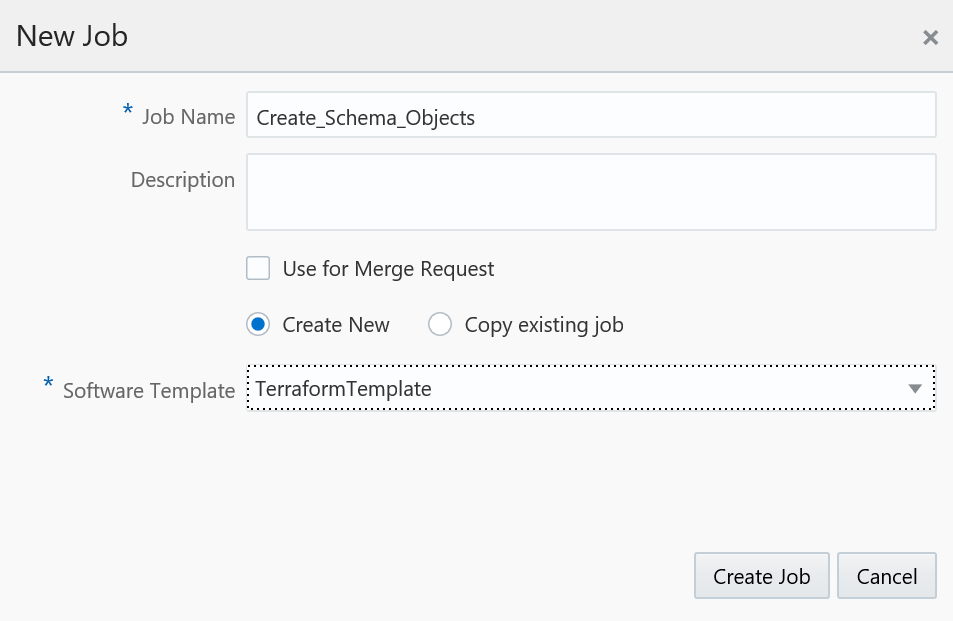
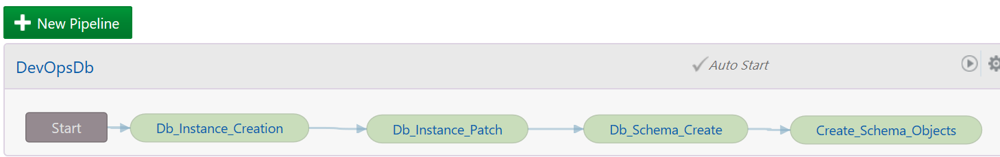

# DevOpsDb Flyway Workshop

This workshop must be done after this one  [DevOpsDb](https://github.com/cpruvost/devopsdb). 

This workshop guides you through the setup, and the configuration of a Job in an Oracle Developer Cloud Service pipeline in order to create all objects (tables, procedures,..) of a schema named QUIZFLYWAY. 

So in Developer Cloud service on your  project (ex DevOpsDb1) you have to create a second git repository named "quizdb". Click on "New Repository" and choose to import the devopsdbflyway (github repository)

 

After that look at the code then you have to understand that we use Flyway in order to create all the objects of the schema. If you do not know Flyway then you can just look at the SQL files (Menu Code in Oracle Developer Cloud Service), it is simple to understand. Note that we use EBR as you can see in each SQL file that the first line is like "alter session set edition=xxxx" 



Now create a new job with the name "Create_Schema_Objects".  



Add the Git Source Control "quizdb.git"


Then add a Unix Shell Builder with the code below

```shell
export FLYWAY_USER=quizflyway
echo "FLYWAY_USER = $FLYWAY_USER"
export FLYWAY_PASSWORD=AlphA_2014_
echo "FLYWAY_PASSWORD = $FLYWAY_PASSWORD"
export DBNodePublicIP=$(cat /tmp/outputIP.txt)
echo "DBNodePublicIP = $DBNodePublicIP"
export DBCONSTRINGPDB=$(cat /tmp/outputDBCONSTRINGPDB.txt)
echo "DBCONSTRINGPDB = $DBCONSTRINGPDB"
export FLYWAY_URL=jdbc:oracle:thin:@$DBNodePublicIP:1521/$DBCONSTRINGPDB
mvn flyway:migrate
```

As you see we use Maven in order to execute all the SQL orders with the Flyway Tool. We put the jdbc driver in the libs of the project and we do not get it from Oracle Maven Repository. It is an anti-pattern but it is more simple for this workshop.

Run your job. Note this is the step 4 of the pipeline so it will run only if the steps 1, 2 and 3 are OK (see previous workshop).

Look at the build Log and you should see :
```shell
[INFO] Creating Schema History table: "QUIZFLYWAY"."flyway_schema_history"
[INFO] Current version of schema "QUIZFLYWAY": << Empty Schema >>
[INFO] Migrating schema "QUIZFLYWAY" to version 1 - Create quiz question answer tables
[INFO] Migrating schema "QUIZFLYWAY" to version 1.1 - Create game gameanswer users userroles
[INFO] Migrating schema "QUIZFLYWAY" to version 1.2 - Insert questions answers quizzes
[INFO] Successfully applied 3 migrations to schema "QUIZFLYWAY" (execution time 00:03.758s)
```

Now we will see how the feature Edition-Based Redefinition is nice in Oracle Db EE. With this feature you can have a version on all objects except tables. So instead using tables you must use editionning views.

Use Oracle SQL Developer to connect to QUIZFLYWAY.

Look at the tables. You see the tables of QUIZFLYWAY and a technical table (flyway_schema_history) that gives you version information.

Look at the Editionning Views. it is empty because we are in the default edition of the database.

In SQL workseet (of SQLDeveloper) run the code below
```shell
alter session set edition=V1
```

Look at the Editionning Views. You can see now V_QUIZ with 2 attributes (ID, NAME).

Look at function FINDQUIZNAME. You can see that this function return 'EMPTY' if the quiz number is not known.

In SQL workseet (of SQLDeveloper) run the code below

```shell
alter session set edition=V1POINT1
```

Look at the Editionning Views. You can see now V_QUIZ with 1 attribute more (DETAILS).

In SQL workseet (of SQLDeveloper) run the code below

```shell
alter session set edition=V1POINT2
```

Look at function FINDQUIZNAME. You can see that this function return ''THIS QUIZ DOES NOT EXIST'' if the quiz number is not known.

Ok Now you just have to add the last step on the pipeline.



Run the pipeline again and now you have a complete pipeline !